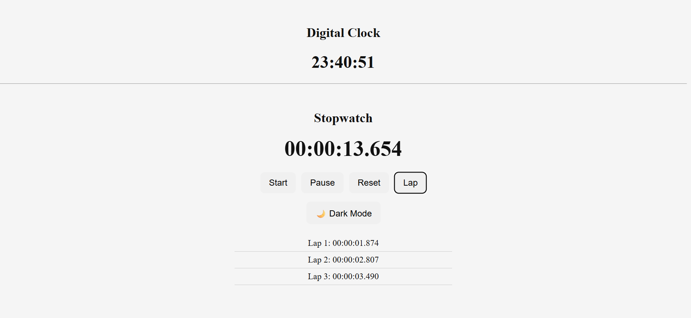
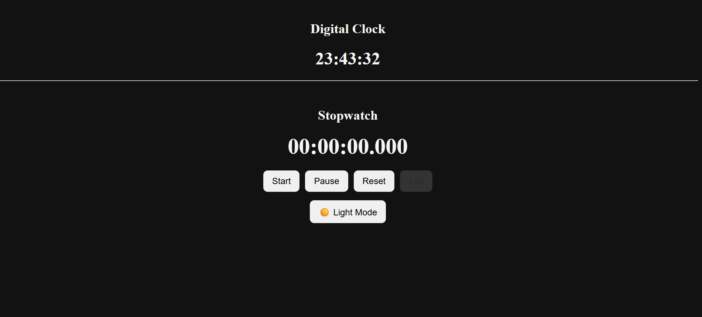

⏱ React Digital Clock & High-Precision Stopwatch

📌 Project Overview

This project is a high-precision digital clock and stopwatch application built using React.js, designed to demonstrate accurate time handling, clean state management, and modern UI/UX practices.

Unlike basic stopwatch implementations that rely on setInterval (which causes time drift and performance issues), this application uses performance.now() and requestAnimationFrame() to ensure smooth, accurate, and real-time millisecond updates.

The project is fully responsive, includes Dark/Light mode, lap tracking, and CSS animations, making it suitable for real-world use and an excellent showcase for freelancing and portfolio purposes.

🚀 Features

    ⏰ Digital Clock

        -Displays real-time system time

        -Updates every second

        -Clean and readable format

    ⏱ High-Precision Stopwatch

        -Accurate millisecond timing

        -Smooth updates without lag

        -Start, Pause, and Reset controls

        -No time drift (even after pause/resume)

    🔔 Lap Functionality

        -Record multiple lap times

        -Displays laps in a clean list

        -Disabled when stopwatch is paused

        -Automatically resets with stopwatch reset

    🌙 Dark / Light Mode

        -Toggle between dark and light themes

        -Applied globally using body class

        -Improves accessibility and user experience

    🎨 CSS Animations

        -Subtle pulse animation on time update

        -Enhances visual feedback

        -Lightweight and performance-friendly

    📱 Mobile Responsive UI

        -Works perfectly on mobile, tablet, and desktop

        -Flexible layout using CSS Flexbox

        -Touch-friendly buttons

    🛠 Tech Stack

        -React.js

        -JavaScript (ES6+)

        -CSS3

        -React Hooks

        -useState

        -useEffect

        -useRef

    🧠 Key Technical Highlights

        -High-resolution timing using performance.now()

        -Smooth rendering loop with requestAnimationFrame

        -No unnecessary re-renders using useRef

        -Proper cleanup to prevent memory leaks

        -Clean separation of logic, UI, and styling

        -Scalable and maintainable component structure

    🧪 Concepts Demonstrated

        -State management with React Hooks

        -Side-effects handling with useEffect

        -Mutable references using useRef

        -Performance-optimized animations

        -Responsive design principles

        -Component-based architecture

    📦 Installation & Usage

        -npm install

        -npm start

The application will run locally on:

http://localhost:3000

💼 Freelancing & Real-World Use Case

This project demonstrates the ability to:

    -Build production-ready React components

    -Handle performance-critical features

    -Create clean, reusable, and readable code

    -Design responsive and user-friendly interfaces

    -Implement real-world features like theming and lap tracking

It can be extended further for:

    -Fitness tracking apps

    -Productivity tools

    -Time-management dashboards

    -Embedded widgets in larger applications

📸 Screenshots

### Light Mode

### Dark Mode

👤 Author

Anubhav Choudhary
Frontend Developer | React.js | JavaScript